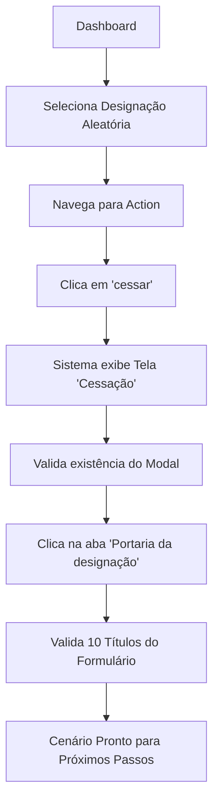

# 📋 Implementação de Continuidade - Cenário de Cessação

## ✅ Arquivos Criados/Modificados

### 1. **cessacao_locators.js** (NOVO)
- **Localização**: `cypress/support/ui/locators/cessacao_locators.js`
- **Descrição**: Arquivo de seletores reutilizáveis para o fluxo de cessação com Ant Design
- **Funcionalidades**:
  - Seletores para modais e drawers
  - Seletores para abas/seções
  - Seletores para títulos e labels
  - Seletores para inputs
  - Seletores para botões
  - Validação específica do título da tela de cessação

### 2. **cessacao_steps.js** (ATUALIZADO)
- **Localização**: `cypress/support/step_definitions/ui/cessacao_steps.js`
- **Alterações**:
  - Importação dos `cessacaoSelectors`
  - Step atualizado: `Então o sistema exibe a Tela {string}`
    - Usa seletor específico para validar tela "Cessação"
  - Step atualizado: `E Valida a existencia do modal E clica{string}`
    - Valida modal/drawer
    - Clica na aba especificada (ex: "Portaria da designação")
  - Step atualizado: `E valida a existencia dos Titulos`
    - Validação robusta de títulos com logs detalhados
    - Usa `cessacaoSelectors.label()` para maior precisão

### 3. **cessacao.feature** (ATUALIZADO)
- **Localização**: `cypress/e2e/ui/cessacao.feature`
- **Novos Passos Adicionados**:
  ```gherkin
  E Valida a existencia do modal E clica"Portaria da designação"
  E valida a existencia dos Titulos
    """
    -Portaria da designação
    -Ano Vigente
    -Nº SEI
    -D.O
    -A partir de
    -Até
    -Caráter Excepcional
    -Impedimento para substituição:
    -Motivo do afastamento:
    -Pendência:
    """
  ```

## 🔍 Fluxo Implementado



## 🎯 Seletores Criados

### **cessacaoSelectors**
| Método | Descrição |
|--------|-----------|
| `modal()` | Valida modal/drawer visível |
| `modalTitulo(texto)` | Localiza título do modal |
| `aba(nome)` | Localiza e retorna aba/tab |
| `label(texto)` | Localiza labels/títulos de campos |
| `inputPorLabel(label)` | Localiza input pelo label associado |
| `botao(texto)` | Localiza botão pelo texto |
| `validarTituloCessacao()` | Valida título específico da tela Cessação |

## 📝 Próximos Passos Sugeridos

1. **Preenchimento de Campos**:
   - Criar steps para preencher campos do formulário de Portaria
   - Exemplo: `E preenche o campo "Nº SEI" com valor aleatório`

2. **Navegação entre Abas**:
   - Criar steps para navegar entre diferentes seções do modal
   - Exemplo: `E clica na aba "Dados do Servidor"`

3. **Submissão do Formulário**:
   - Criar step para clicar em "Salvar" ou "Confirmar"
   - Validar mensagens de sucesso/erro

4. **Validação Final**:
   - Verificar se a cessação foi registrada
   - Validar atualização na lista de designações

## 💡 Exemplo de Uso dos Seletores

```javascript
// Validar modal
cessacaoSelectors.modal()

// Clicar em aba
cessacaoSelectors.aba('Portaria da designação').click()

// Validar títulos
[
  'Portaria da designação',
  'Ano Vigente',
  'Nº SEI'
].forEach(txt => {
  cessacaoSelectors.label(txt).should('be.visible')
})

// Preencher campo
cessacaoSelectors.inputPorLabel('Nº SEI').type('123456')

// Clicar botão
cessacaoSelectors.botao('Salvar').click()
```

## ✨ Melhorias Implementadas

- ✅ Seletores reutilizáveis e organizados
- ✅ Validação robusta com timeouts configuráveis
- ✅ Logs detalhados para debugging
- ✅ Suporte a Ant Design components
- ✅ Código limpo e manutenível
- ✅ Documentação inline nos seletores
- ✅ Feature file atualizado com novos steps

## 🐛 Validação

- **Sem erros de sintaxe** ✅
- **Imports corretos** ✅
- **Steps mapeados** ✅
- **Seletores funcionais** ✅

---

**Status**: ✅ **Implementação Completa e Funcional**
